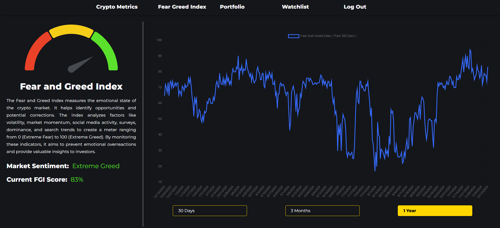
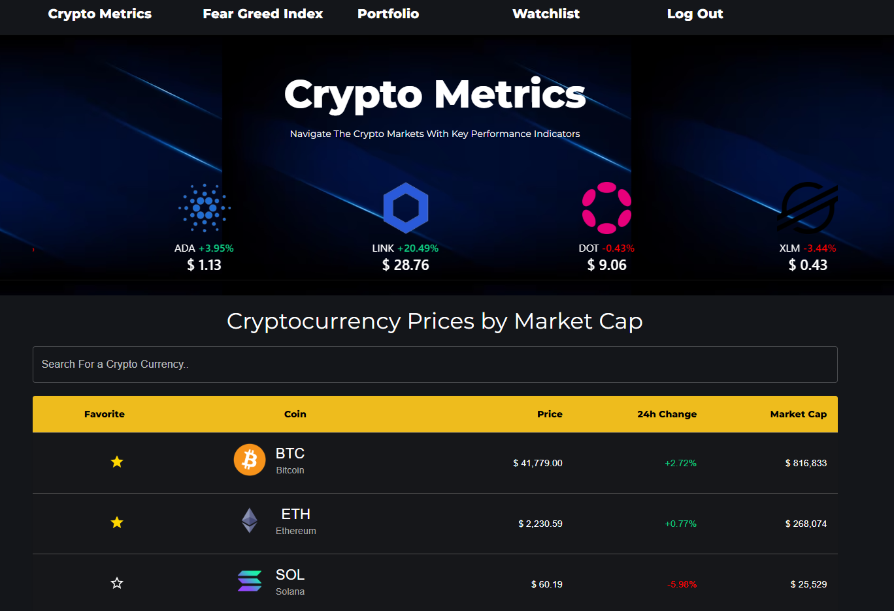
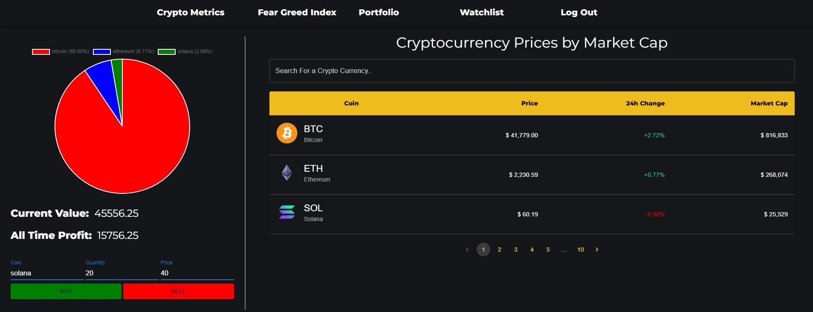
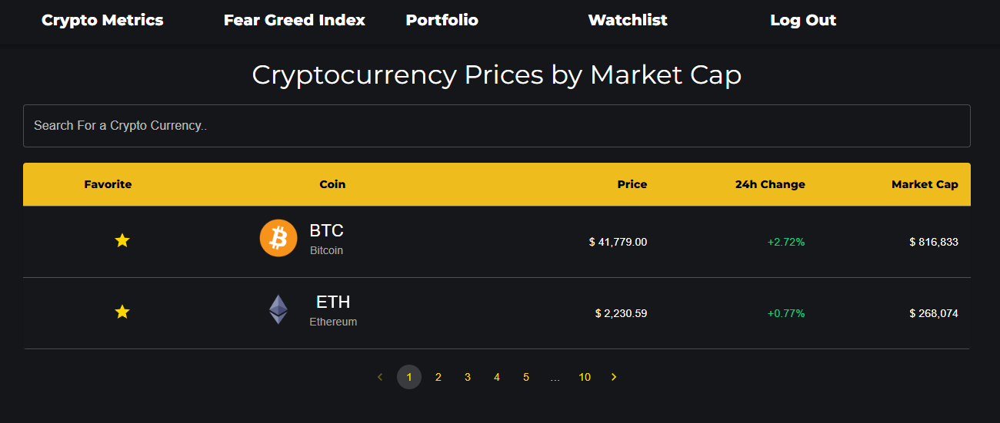

# Crypto Analytics Platform

The Crypto Analytics Platform is a powerful tool designed to provide insights into the cryptocurrency market, enabling users to track key metrics, manage their portfolio, and make informed investment decisions.

## Screenshots

### 1. Fear and Greed Index

The Fear and Greed Index measures the emotional state of the crypto market. It analyzes factors such as volatility, momentum, and sentiment to generate a score ranging from 0 (Extreme Fear) to 100 (Extreme Greed). This helps users identify market trends and potential corrections.

- **Key Features:**
  - Displays the current sentiment (e.g., "Extreme Greed") and FGI Score.
  - Interactive graph showcasing the index trends over the past year.

### 2. Landing Page

The landing page provides an overview of the platform, including key performance indicators and a list of major cryptocurrencies with their current prices, 24-hour changes, and market caps.

- **Key Features:**
  - Intuitive design showcasing real-time metrics for popular cryptocurrencies.
  - Easy navigation between sections like the Fear and Greed Index, Portfolio, and Watchlist.

### 3. Portfolio

The portfolio section allows users to track their cryptocurrency investments. A pie chart visually represents the allocation of different assets, while key statistics such as current value and all-time profit are displayed.

- **Key Features:**
  - Pie chart showing asset allocation.
  - Real-time updates on current portfolio value and profit.
  - Buy/Sell functionality for managing assets.

### 4. Watchlist

The watchlist helps users monitor their favorite cryptocurrencies, providing up-to-date information on their prices, market caps, and 24-hour changes.

- **Key Features:**
  - Favorites system to track important cryptocurrencies.
  - Pagination for browsing a large list of assets.
  - Real-time updates for each asset.

---

## Technologies Used
- **Frontend:** React, Redux
- **Backend:** Node.js, Express
- **Database:** MongoDB
- **APIs:** CoinGecko API for real-time cryptocurrency data

Feel free to explore the platform and provide feedback to help us improve!

##How To Run

### `npm i -f`

### `modify the .env file in backend`

### `npm run setup`

### `npm run start`

Runs the frontend and backend.\
Open [http://localhost:3000](http://localhost:3000) to view frontend in your browser.
Open [http://localhost:5000](http://localhost:5000) to view backend in your browser.

